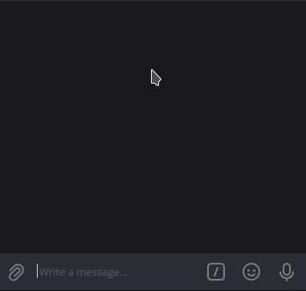

# Tic-tac-toe game

Telegram bot with tic-tac-toe game against pre-trained AI.

This is a pet project made for educational purposes (while studying Kotlin and Neural network basics).

Training models are located [here](https://gitlab.com/adversarial-ai/tic-tac-toe-training).

